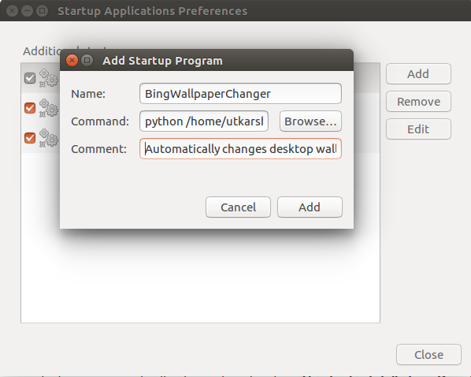

# bing-desktop-wallpaper-changer
Automatically downloads and changes desktop wallpaper to Bing Photo of the Day.

## Synopsis
Python Script for automatically downloading and changing the desktop wallpaper to Bing Photo of the day. The script runs automatically at the startup and works on Linux with Gnome. Works perfectly on Ubuntu 16.10.

## What does it do?
It grabs images exactly the same way *Microsoft* uses to put it up on its page - using **XML/RSS/JSON**. You can't scrape the website directly. After searching on the internet for long I found out the link - *http://www.bing.com/HPImageArchive.aspx?format=xml&idx=0&n=1&mkt=en-US*

Here we can get data in any of the formats but substituting the value of **format=[value]** in the link.

**idx** denotes the *day before the current day*. idx=0 means current day, idx=1 means yesterday and so on.
**n** is an integer denoting the *number of days before the day denoted by idx*. It grabs data about all the n number of images.
**mkt** denotes the *area*. The script will try to match your locale to one of the supported Bing Market areas, falling back to 'en-US' if it fails to do so.

All the wallpapers are stored in '**/home/[user]/Pictures/BingWallpapers/**'

## Installation
Clone/download project. Open terminal in the root folder of the project

1. Type in either of the two commands
    * Recommended

      ```shell
      pip install -r requirements.txt
      ```
    *  Or install them individually

        ```shell
        sudo apt-get install python-bs4
        ```
        ```shell
        sudo apt-get install python-lxml
        ```
2. Then add the script as a startup application. Type in terminal

    ```shell
    gnome-session-properties
    ```
    then add a startup program as:
    ```
    Name: BingWallpaperChanger
    Command: python /path/to/main.py
    Comment: Automatically changes desktop wallpaper!
    ```
    

If you run gnome 3 from Fedora, you have to create the file

/home/[user]/.config/autostart/bing-desktop-wallpaper-changer.desktop

    the file contents look like:
    ```
    [Desktop Entry]
    Type=Application
    Terminal=false
    Exec=python /path/to/bing-desktop-wallpaper-changer/main.py
    Name=Bing Desktop Wallpaper Changer
    ```

Replace [user] with your actual user name and /path/to/ with your actual
parent directory for the bing-desktop-wallpaper-changer directory.

## Dependencies
* [BeautifulSoup4](https://www.crummy.com/software/BeautifulSoup/)
* [lxml](http://lxml.de/)
* python-gi module

## To do
* Store the details about the previous wallpapers (viz. date, filename, brief description) in an XML file so that the user can see that later too.
* Permitting a limited number of wallpapers to be stored in the directory (disk space constraints)

*Any other suggestions welcome!*

## Author
Utkarsh Gupta

## License
[MIT license](http://opensource.org/licenses/mit-license.php).
